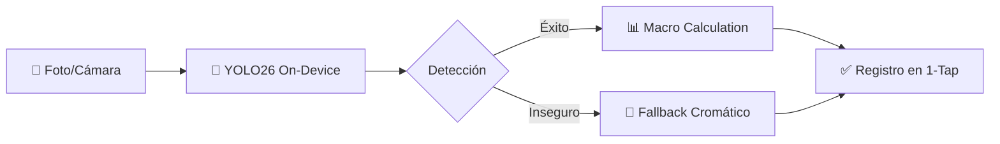
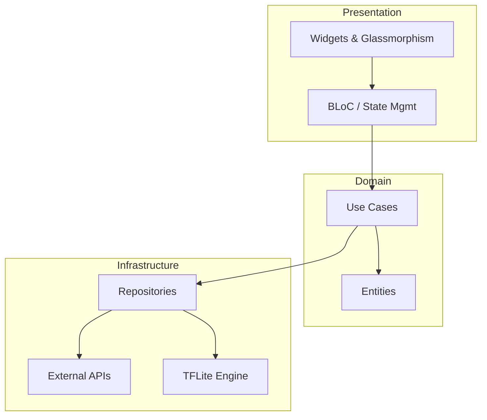

<p align="center">
  
</p>

<h1 align="center">Nutrifoto AI</h1>

<p align="center">
  <strong>Computer Vision × Nutrición Inteligente</strong><br>
  <sub>Detección de alimentos on-device con YOLO26, coaching nutricional con Gemini y un motor de descubrimiento de recetas multi-fuente — una experiencia móvil premium con UI Glassmorphism.</sub>
</p>

<p align="center">
  
  
  
  
  
</p>

<p align="center">
  <a href="#-pruébala-ahora"><strong>Probar »</strong></a>&nbsp;&nbsp;·&nbsp;&nbsp;
  <a href="#-descripción"><strong>Descripción »</strong></a>&nbsp;&nbsp;·&nbsp;&nbsp;
  <a href="#-arquitectura"><strong>Arquitectura »</strong></a>&nbsp;&nbsp;·&nbsp;&nbsp;
  <a href="#-data-science--entrenamiento"><strong>Data Science »</strong></a>&nbsp;&nbsp;·&nbsp;&nbsp;
  <a href="#-instalación"><strong>Instalación »</strong></a>
</p>

---

## 📱 Pruébala Ahora

> [!IMPORTANT]
> **¿Eres reclutador?** Puedes evaluar la experiencia técnica en 30 segundos sin necesidad de compilar nada:

| Canal | Enlace |
| :--- | :--- |
| 📦 **APK Directo** | [Descargar última release](https://github.com/Paimilla/nutrifoto/releases) |
| 🎬 **Video Demo** | [Ver Walkthrough en YouTube](https://youtu.be/Papv_p2c90o?si=4MR1eUosuUuBJtQS) |
| 🌐 **Appetize.io** | [Abrir en Navegador](https://appetize.io/app/b_gockvto6qiz4mdnfkatflaezui) (Emulador real) |

---

## 📖 Descripción

**Nutrifoto AI** no es solo una app de registro de calorías; es un ecosistema de **visión artificial aplicada** diseñado para resolver la fricción del seguimiento nutricional. 

El proyecto destaca por su **modelo YOLO26 personalizado**, entrenado específicamente para reconocer **comida chilena y latina**, superando las limitaciones de los modelos genéricos que suelen fallar con platos locales como empanadas, humitas o completos.



---

## ✨ Características Técnicas Destacadas

### 🎯 Motor de Visión Híbrido (Edge AI)
Implementación de **YOLO26 float16** mediante `tflite_flutter`, logrando inferencia en tiempo real (~120ms) sin depender de la nube. Incluye un sistema de **análisis cromático inteligente** como fallback para mejorar la robustez en condiciones de baja iluminación.

### 🍳 Orquestador de Recetas Inteligente
Un motor de búsqueda "Cascade" que consulta secuencialmente diversas fuentes (Spoonacular, OpenFoodFacts, USDA y DB Local), aplicando:
- **Deduplicación semántica** para evitar resultados repetidos.
- **Traducción dinámica** de ingredientes mediante IA para fuentes en inglés.
- **Enriquecimiento de datos** cruzando información entre APIs.

### 🎤 NLP con Arquitectura Dual
Procesamiento de lenguaje natural para registro por voz ("Me comí un pan con palta y un café") utilizando **Groq (Llama 3.3 70B)** por su baja latencia, con **Gemini 3.1 Flash** como respaldo de alta precisión.

---

## 🏗️ Arquitectura de Software

El proyecto sigue los principios de **Clean Architecture**, asegurando un código mantenible, testeable y desacoplado de las APIs externas.



| Capa | Tecnologías Clave |
| :--- | :--- |
| **UI** | Flutter 3.11+, Glassmorphism, fl_chart, Google Fonts (Manrope), Soporte Dark/Light Mode |
| **IA/ML** | TFLite (YOLO26), Groq (Llama 3.3), Gemini 3.1 |
| **Data** | OpenFoodFacts API, Spoonacular, USDA |
| **Persistence** | Shared Preferences, Local JSON Assets |

---

## 🧪 Data Science & Entrenamiento

Uno de los mayores retos fue la falta de datasets de calidad para comida chilena. Para solucionar esto:

1. **Curación de Dataset**: Se recopilaron y etiquetaron imágenes para **30 clases específicas** (Empanadas, Completos, Cazuela, etc.). El dataset fue curado y procesado íntegramente en Roboflow: **[Ver Dataset en Roboflow](https://app.roboflow.com/nutriplato/comida-chilena-mbfky/models)**.
2. **Transfer Learning**: Se utilizó YOLO26 como base, optimizando hiperparámetros para dispositivos móviles.
3. **Optimización**: Conversión a `float16` para reducir el tamaño del modelo sin sacrificar precisión significativa.

<p align="center">
  
  <br><em>Proceso de etiquetado y aumentación de datos en Roboflow para asegurar robustez frente a diferentes ángulos y luces.</em>
</p>

> [!TIP]
> Puedes revisar el dataset curado y el proceso de entrenamiento completo:
> 🖼️ **[Dataset en Roboflow](https://app.roboflow.com/nutriplato/comida-chilena-mbfky/models)**
> 📓 **[Notebook YOLO26_ComidaChilena.ipynb](assets/models/YOLO26_ComidaChilena.ipynb)**

### 📊 Métricas y Resultados

<p align="center">
  
  <br><em>Curvas de Loss (Box, Cls, DFL) y resumen de precisión mAP@50.</em>
</p>

<p align="center">
  
  <br><em>Inferencia en tiempo real: Detección múltiple con altos niveles de confianza.</em>
</p>

<p align="center">
  
  <br><em>Precisión mAP desglosada por cada una de las 30 clases detectadas.</em>
</p>

---

## 🛠️ Desafíos Técnicos y Soluciones

Durante el desarrollo de Nutrifoto AI, se abordaron problemas complejos de ingeniería:

| Desafío | Solución Implementada |
| :--- | :--- |
| **Latencia de Inferencia** | Se optimizó el pipeline de imagen con `compute` isolate en Flutter para evitar bloqueos del UI Thread durante la inferencia de YOLO26. |
| **Diversidad de APIs** | Se implementó un **Orquestador Cascade** que maneja timeouts y fallbacks automáticos entre Edamam, Spoonacular y USDA. |
| **Sesgo de Datos** | Para la comida chilena, se utilizó **Data Augmentation** agresiva (rotación, ruido, cambios de saturación) para compensar el dataset pequeño inicial. |
| **Consistencia de Macros** | Sistema de **Normalización de Unidades** que unifica gramos, onzas y porciones provenientes de diferentes fuentes globales. |

---

## 📱 Recorrido por la Experiencia (UX)

La aplicación está diseñada bajo el concepto **"Magazine-First"**, priorizando la legibilidad y el impacto visual.

1.  **Dashboard Inteligente**: Resumen dinámico con `fl_chart` que se actualiza en tiempo real según el consumo y las metas.
2.  **AI Scanner Hub**: Centraliza los 4 métodos de entrada (Cámara, Voz, Escáner de Barras y Búsqueda Manual).
3.  **Asistente Nutricional**: Chatbot con **Gemini 1.5** que analiza tu diario y te da consejos personalizados basados en tus macros restantes.
4.  **Descubrimiento de Recetas**: Motor de búsqueda con filtros avanzados (Keto, Vegano, Tiempo) y visualización de alta calidad.

---

## 🏗️ Estructura del Proyecto

El código está organizado siguiendo una estructura de **Clean Architecture** estricta:

```text
lib/
├── application/       # Orquestación, Casos de Uso y Servicios de App
│   ├── usecases/      # Lógica de negocio pura (Tracking, Insights, History)
│   └── services/      # Orquestadores de fuentes y configuración
├── domain/            # Modelos de datos (Entities) e Interfaces (Repositories)
│   ├── models/        # NutritionModels, TrackingModels
│   └── repositories/  # Definición de contratos para datos
├── infrastructure/    # Implementaciones técnicas y acceso a Datos
│   ├── providers/     # Clientes de APIs (Spoonacular, Edamam, YOLO26 Engine)
│   └── repositories/  # Persistencia local (JSON/SharedPrefs)
└── presentation/      # Capa de Interfaz de Usuario
    ├── screens/       # Pantallas principales (Home, Scanner, Recipes, Assistant)
    └── widgets/       # Componentes reutilizables y Design System
```

---

## ✅ Calidad y Testing

Para asegurar la estabilidad de una app tan dependiente de servicios externos, se implementó:

- **Unit Testing**: Pruebas de los casos de uso y modelos de datos.
- **Mocking**: Uso de mocks para simular respuestas de APIs y el motor de TFLite.
- **Static Analysis**: Configuración estricta de `flutter_lints` para mantener un código limpio y legible.
- **CI Readiness**: El proyecto está preparado para pipelines de integración continua.

---

## 🚧 Roadmap de Desarrollo

- [ ] **Sincronización Cloud**: Integración con Firebase/Supabase para persistencia multi-dispositivo.
- [ ] **Modo Offline Extendido**: Caché local de recetas populares y expansión de la base de datos chilena.
- [ ] **Social Features**: Posibilidad de compartir logros y recetas con amigos.
- [ ] **Integración con Health Connect**: Sincronización de calorías quemadas desde relojes inteligentes.

---

## 🇨🇱 Clases Detectadas (30)

El modelo está optimizado para reconocer los siguientes alimentos y preparaciones:

<table>
<tr><td>

| # | Clase |
|---|-------|
| 1 | Arroz |
| 2 | Arvejas |
| 3 | Brócoli |
| 4 | Calzones rotos |
| 5 | Carne |
| 6 | Cazuela |
| 7 | Charquicán |
| 8 | Choripán |
| 9 | Completos |
| 10 | Durazno |

</td><td>

| # | Clase |
|---|-------|
| 11 | Empanada |
| 12 | Ensalada chilena |
| 13 | Huevos fritos |
| 14 | Humitas |
| 15 | Manzana |
| 16 | Mote con huesillo |
| 17 | Naranja |
| 18 | Palomitas |
| 19 | Palta |
| 20 | Papas fritas |

</td><td>

| # | Clase |
|---|-------|
| 21 | Pasta |
| 22 | Pastel de choclo |
| 23 | Pescado frito |
| 24 | Pizza |
| 25 | Plátano |
| 26 | Pollo |
| 27 | Porotos con riendas |
| 28 | Salmón |
| 29 | Sopaipillas |
| 30 | Tiramisú |

</td></tr>
</table>

---

## 🚀 Instalación y Desarrollo

### Prerrequisitos
- Flutter SDK `^3.11.1`
- Android Studio / VS Code

### 1. Clonar y Configurar
```powershell
git clone https://github.com/Paimilla/nutrifoto.git
cd nutrifoto
Copy-Item run.example.ps1 run.ps1
```

### 2. Ejecutar con API Keys
Edita `run.ps1` con tus credenciales o ejecuta directamente con flags:

```bash
flutter run --release \
  --dart-define=GEMINI_API_KEY=TU_KEY \
  --dart-define=GROQ_API_KEY=TU_KEY \
  --dart-define=SPOONACULAR_API_KEY=TU_KEY
```

---

## 📄 Licencia
Este proyecto está bajo la licencia **MIT**.

<p align="center">
  <strong>Desarrollado con 💜 por Francisco Paimilla</strong><br>
  <sub>Santiago, Chile · 2026</sub>
</p>
