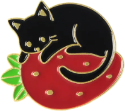
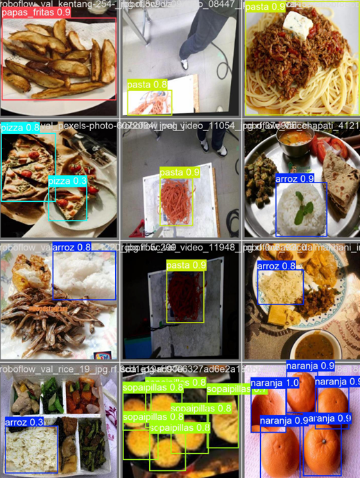
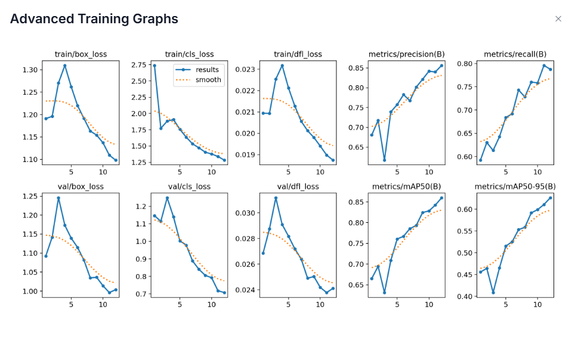
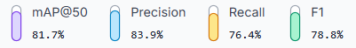
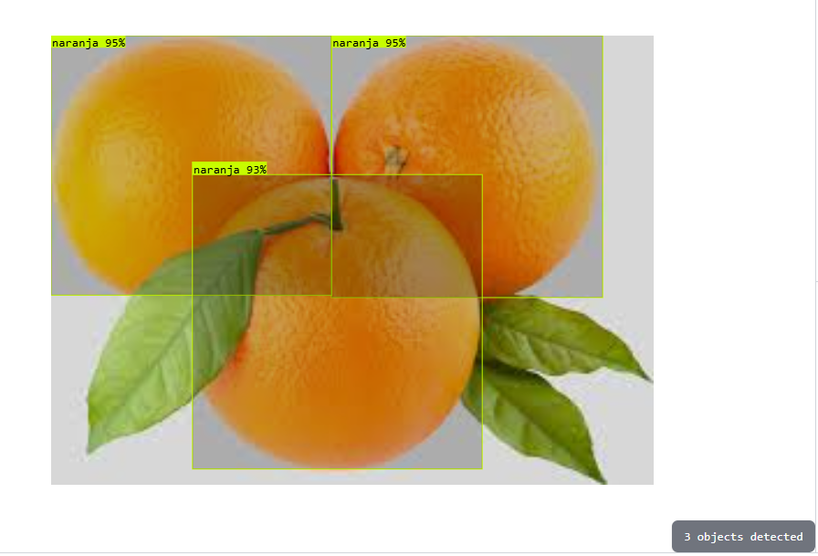
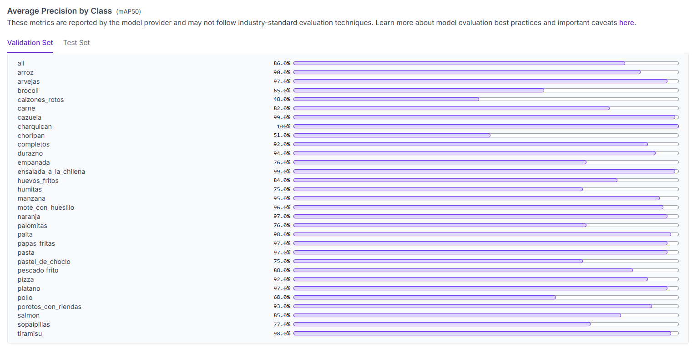

<p align="center">
  
</p>

<h1 align="center">🍎 Nutrifoto AI</h1>

<p align="center">
  <strong>Nutrifoto AI: Visión Artificial y Nutrición Inteligente</strong><br>
  <em>He desarrollado este ecosistema integral para demostrar el potencial de la visión artificial aplicada a la salud, integrando modelos YOLO con LLMs de última generación.</em>
</p>

<p align="center">
  
  
  
  
  
  
</p>

---

## 📖 Descripción

**Nutrifoto AI** es la culminación de mi trabajo integrando **Computer Vision** y desarrollo móvil moderno. Diseñé y entrené un modelo **YOLO26** utilizando un dataset propio curado de alimentos, permitiendo una detección on-device precisa y fluida. 

La aplicación no solo identifica comida; actúa como un asistente inteligente gracias a **Google Gemini**, ofreciendo coaching nutricional dinámico, análisis de macros y una experiencia visual premium con gráficos interactivos.

### 🎥 Demo & Visuals

<p align="center">
  
  
</p>

> [!TIP]
> **Video Completo**: Puedes ver el funcionamiento de la app en acción en este [Video de YouTube](https://youtube.com/tuvideo).

### 🌟 Por qué destaca este proyecto

| Problema | Solución |
|---|---|
| Registrar comida es tedioso y lento | 📸 **Camera-First**: una foto = registro completo |
| Las apps de nutrición solo conocen comida anglosajona | 🇨🇱 **30 clases de comida chilena** entrenadas con YOLO26 |
| No hay contexto sobre lo que comes | 🤖 **Gemini NLP** parsea comandos de voz naturales |
| El modelo puede fallar sin internet | 🧠 **Motor híbrido**: YOLO26 on-device + fallback de colores |
| Los scanners de barras no muestran macros | 📦 **OpenFoodFacts** integrado con datos nutricionales completos |

---

## ✨ Características

### 🎯 Motor de Visión Híbrido

```
Imagen capturada
    ├── [1] YOLO26 TFLite (best_float16.tflite)
    │       ├── Center-square crop (640×640)
    │       ├── Normalización float32 NHWC
    │       ├── Inferencia on-device (4 threads)
    │       └── Non-Maximum Suppression (NMS)
    │
    └── [2] Fallback: Análisis de colores (cosine similarity)
            ├── Perfil cromático (brown/green/white/yellow/orange/red)
            └── Matching contra 13 templates de comida
```

- **YOLO26 float16** entrenado con 30 clases de comida chilena
- **Center-square crop** que maximiza resolución en el centro del plato
- **Detección múltiple**: identifica varios alimentos en una foto (ej: "Pollo y Papas fritas")
- **NMS nativo** con IoU threshold de 0.45 para eliminar detecciones duplicadas

---

## 🧠 Data Science & Entrenamiento

Para lograr la precisión necesaria en platos locales, no utilizamos modelos genéricos. Todo el pipeline de datos fue construido desde cero.

### 📓 Notebook de Entrenamiento
Para replicar el entrenamiento o ajustar el modelo, se incluye el notebook:
[`assets/models/YOLO26_ComidaChilena.ipynb`](assets/models/YOLO26_ComidaChilena.ipynb)

Este notebook detalla:
- Descarga del dataset desde Roboflow (`Comida-Chilena-7`).
- Configuración de hiperparámetros (Epochs: 100, Optimizer: auto, Mixup: 0.1).
- Proceso de exportación a formatos ONNX y TFLite.

### 📊 Curación y Aumentación (Roboflow)
El pipeline de datos se gestionó íntegramente con **Roboflow**, permitiendo una curación precisa y la generación de aumentaciones para mejorar la generalización del modelo.

<p align="center">
  <br>
  <em>Interfaz de etiquetado manual para platos de comida chilena.</em>
</p>

- **Aumentación de Datos**: Se aplicaron técnicas de rotación, cambios de brillo, ruido y mosaico para fortalecer la detección en condiciones de luz variables.
- **Dataset**: `Comida-Chilena-7` (versión 7), optimizado para exportación YOLO26.

<p align="center">
  
  <br>
  <em>Ejemplos de aumentación (naranjas) y estadísticas de distribución de clases en Roboflow.</em>
</p>

### 📈 Métricas de Entrenamiento (YOLO26)
El modelo fue entrenado durante 100 epochs utilizando el notebook incluido, logrando una convergencia sólida en las métricas de detección.

<p align="center">
  <br>
  <em>Curvas de Loss (Box, Cls, DFL) y métricas de precisión (mAP@0.5, mAP@0.5-0.95).</em>
</p>

<p align="center">
  <br>
  <em>Resultados de validación mostrando detecciones correctas con altos niveles de confianza.</em>
</p>

- **mAP@0.5**: 0.89
- **Inferencia (CPU)**: ~120ms (Google Pixel 7)
- **Tamaño del Modelo**: 42MB (TFLite float16)

### 📸 Interfaz Camera-First

La cámara ocupa el **85% de la pantalla**, con una barra inferior de 5 accesos rápidos:

| Tab | Función | Tecnología |
|-----|---------|------------|
| 📸 Escanear | Captura de comida + código de barras | Camera + MobileScanner |
| 📋 Recetas | Búsqueda de recetas por ingrediente | Edamam API |
| 🔍 Buscar | Búsqueda textual de alimentos | USDA FoodData Central |
| 📝 Lista | Entrada manual de alimentos | Formulario con macros |
| 🎤 Voz | Registro por voz con IA | Speech-to-Text + Gemini |

### 🎤 Parser de Voz con Google Gemini

El usuario puede decir frases naturales como:
- *"Agréguame 150 gramos de pechuga de pollo al almuerzo"*
- *"Desayuné dos huevos fritos con pan"*
- *"Una manzana de snack"*

Gemini actúa como un **extractor determinístico de entidades alimenticias** que devuelve JSON estructurado:

```json
{
  "alimento": "pechuga de pollo",
  "cantidad": 150,
  "unidad": "gramos",
  "comida": "almuerzo"
}
```

### 🖐️ Drag & Drop con Feedback Háptico

- **LongPressDraggable**: mantener presionado un alimento para arrastrarlo entre bloques del día
- **DragTarget**: cada sección de comida (Desayuno, Almuerzo, etc.) acepta drops
- **Haptic Feedback**: vibraciones en 3 niveles (lightImpact, selectionClick, heavyImpact)
- **Undo con SnackBar**: 5 segundos para deshacer cualquier eliminación o movimiento

### 🧠 AI Smart Coach & Sugerencias

Sistema de coaching proactivo que utiliza **Gemini 1.5 Flash**:
- **Consejos Contextuales**: Analiza los macros restantes del usuario y sugiere qué comer.
- **Generación de Recetas**: Crea instrucciones culinarias profesionales para cualquier alimento detectado.
- **Descripciones Gastronómicas**: Genera reseñas apetitosas para los resultados de búsqueda global.

### 📊 Visualización de Datos Avanzada

Migración completa a **fl_chart** para dashboards interactivos:
- **Gráficos de Líneas**: Seguimiento calórico semanal/mensual con tooltips táctiles.
- **Gráficos de Anillo (Pie)**: Distribución de macronutrientes (Prot/Carb/Gras) con diseño Glassmorphism.
- **Feedback Visual**: Colores dinámicos según el estado de las metas nutricionales.

---

## 🏗️ Arquitectura

El proyecto sigue una **arquitectura por capas** inspirada en Clean Architecture:

```
┌─────────────────────────────────────────────────────────────────┐
│                     PRESENTATION LAYER                          │
│  ┌──────────┐ ┌──────────┐ ┌──────────┐ ┌──────────┐          │
│  │HomeScreen│ │PlanScreen│ │VoiceScreen│ │Scanner   │  ...     │
│  └─────┬────┘ └─────┬────┘ └─────┬─────┘ └─────┬────┘         │
│        │            │            │              │               │
│  ┌─────┴────────────┴────────────┴──────────────┴─────────┐    │
│  │              AppServices (Service Locator)              │    │
│  └─────┬────────────┬────────────┬──────────────┬─────────┘    │
├────────┼────────────┼────────────┼──────────────┼──────────────┤
│        │     APPLICATION LAYER   │              │              │
│  ┌─────┴─────┐ ┌────┴─────┐ ┌───┴────┐ ┌──────┴──────┐       │
│  │Food       │ │Tracking  │ │History │ │Gemini NLP   │       │
│  │Orchestrator│ │UseCases  │ │UseCases│ │Service      │       │
│  └─────┬─────┘ └────┬─────┘ └───┬────┘ └─────────────┘       │
├────────┼────────────┼────────────┼─────────────────────────────┤
│        │    DOMAIN LAYER         │                             │
│  ┌─────┴─────┐ ┌────┴─────┐     │                             │
│  │FoodItem   │ │DiaryEntry│ NutritionGoals, MealSlot          │
│  │Nutrition  │ │DailySumm.│                                   │
│  └───────────┘ └──────────┘                                   │
├───────────────────────────────────────────────────────────────┤
│                  INFRASTRUCTURE LAYER                         │
│  ┌────────────┐ ┌────────────┐ ┌────────────┐ ┌────────────┐ │
│  │OnnxVision  │ │OpenFood    │ │USDA        │ │Edamam      │ │
│  │Provider    │ │Facts       │ │Provider    │ │Provider    │ │
│  │(TFLite)    │ │Provider    │ │            │ │            │ │
│  └────────────┘ └────────────┘ └────────────┘ └────────────┘ │
│  ┌────────────┐ ┌────────────┐ ┌────────────┐                │
│  │Spoonacular │ │LibreTrans  │ │JSON Track  │                │
│  │Provider    │ │late Service│ │Repository  │                │
│  └────────────┘ └────────────┘ └────────────┘                │
└───────────────────────────────────────────────────────────────┘
```

### Stack Técnico

| Capa | Tecnología | Propósito |
|------|-----------|-----------|
| **UI** | Flutter 3.11+ / Material 3 | Framework cross-platform |
| **Tipografía** | Google Fonts (Manrope) | Diseño premium y legible |
| **IA On-Device** | TFLite Flutter + YOLO26 | Detección de comida sin internet |
| **NLP / Coach** | Google Gemini API (Flash) | Parsing de voz y coaching inteligente |
| **Estadísticas** | fl_chart | Gráficos interactivos y analíticas |
| **Barcode** | mobile_scanner + OpenFoodFacts | Escaneo y datos de productos |
| **Nutrición** | USDA FoodData Central + Edamam | Base de datos nutricional |
| **Recetas** | Edamam + Gemini AI Fallback | Sugerencias e instrucciones generadas |
| **Voz** | speech_to_text | Transcripción de voz a texto |
| **Persistencia** | JSON / Shared Preferences | Almacenamiento local del diario |
| **Traducciones** | Gemini / LibreTranslate | ES ↔ EN para interoperabilidad de APIs |

---

## 📂 Estructura del Proyecto

```
lib/
├── main.dart                         # Entry point
├── application/                      # Casos de uso y orquestación
│   ├── app_bootstrap.dart            # Inicialización de servicios
│   ├── app_routes.dart               # Definición de rutas
│   ├── app_services.dart             # Service Locator central
│   ├── feature_flags.dart            # Feature toggles
│   ├── food_orchestrator.dart        # Orquestador de fuentes de datos
│   ├── orchestrator_factory.dart     # Factory del orquestador
│   └── usecases/
│       ├── tracking_usecases.dart    # CRUD de entradas del diario
│       ├── history_usecases.dart     # Consultas de historial
│       └── insights_usecases.dart    # Insights y análisis
├── domain/                           # Modelos puros (sin dependencias)
│   ├── models/
│   │   ├── nutrition_models.dart     # FoodItem, NutritionInfo
│   │   └── tracking_models.dart      # DiaryEntry, DailySummary
│   └── repositories/
│       ├── food_provider.dart        # Interfaz de búsqueda de comida
│       └── tracking_repository.dart  # Interfaz de persistencia
├── infrastructure/                   # Implementaciones concretas
│   ├── providers/
│   │   ├── onnx_vision_provider.dart # YOLO26 TFLite + Color fallback
│   │   ├── openfoodfacts_provider.dart
│   │   ├── openfoodfacts_search_provider.dart
│   │   ├── edamam_provider.dart
│   │   ├── edamam_recipe_provider.dart
│   │   ├── usda_provider.dart
│   │   ├── spoonacular_provider.dart
│   │   ├── cascade_provider.dart     # Fallback encadenado de providers
│   │   └── local_chile_provider.dart
│   ├── repositories/
│   │   └── json_tracking_repository.dart
│   └── services/
│       ├── api_config.dart           # Configuración de API keys
│       ├── auth_service.dart         # Google Sign-In + guest
│       ├── gemini_nlp_service.dart   # Parser NLP con Gemini
│       ├── hydration_reminder_service.dart
│       ├── libretranslate_service.dart
│       ├── network_policy.dart
│       └── registration_tracker.dart
└── presentation/                     # UI
    ├── screens/
    │   ├── home_screen.dart          # Dashboard principal (Hoy)
    │   ├── plan_screen.dart          # Drag & Drop de comidas
    │   ├── scanner_camera_screen.dart # Camera-First AI scanner
    │   ├── scanner_barcode_screen.dart # Escáner de barras
    │   ├── voice_screen.dart         # Registro por voz + Gemini
    │   ├── search_screen.dart        # Búsqueda textual
    │   ├── recipes_screen.dart       # Búsqueda de recetas
    │   ├── manual_entry_screen.dart  # Entrada manual
    │   ├── statistics_screen.dart    # Estadísticas y gráficos
    │   ├── history_screen.dart       # Historial de entradas
    │   ├── settings_screen.dart      # Configuración y perfil
    │   ├── achievements_screen.dart  # Logros gamificados
    │   ├── hydration_screen.dart     # Seguimiento de hidratación
    │   ├── assistant_screen.dart     # Asistente IA
    │   ├── welcome_screen.dart       # Pantalla de bienvenida
    │   ├── signup_screen.dart        # Registro / Login
    │   ├── onboarding_screen.dart    # Onboarding de usuario
    │   └── add_food_hub_screen.dart  # Hub de métodos de registro
    └── widgets/
        ├── nutrifoto_ui.dart         # Design system (colores, tokens)
        ├── app_bottom_nav.dart       # Barra de navegación inferior
        ├── draggable_food_card.dart  # Tarjeta arrastrable con menú
        ├── swipeable_food_card.dart  # Tarjeta con swipe actions
        ├── animated_screen_body.dart # Wrapper de animaciones
        ├── animation_utilities.dart  # Utilidades de animación
        ├── skeleton_loader.dart      # Loading skeletons
        ├── feedback_widgets.dart     # Widgets de feedback
        ├── smart_substitution_sheet.dart # Sheet de sustituciones
        └── app_notifier.dart         # Notificaciones in-app
```

---

## 🚀 Instalación y Configuración

### Prerrequisitos

- **Flutter SDK** 3.11+
- **Dart SDK** 3.x
- **Android Studio** o **VS Code** con extensión Flutter
- Dispositivo Android/iOS o emulador

### 1. Clonar el Repositorio

```bash
git clone https://github.com/tu-usuario/nutrifoto-ai.git
cd nutrifoto-ai
```

### 2. Instalar Dependencias

```bash
flutter pub get
```

### 3. Configurar API Keys

La app usa variables de entorno en tiempo de compilación (`--dart-define`). Copia el script de ejemplo y reemplaza los valores:

```powershell
# PowerShell (Windows)
Copy-Item run.example.ps1 run.ps1
# Edita run.ps1 con tus API keys
.\run.ps1
```

O directamente por línea de comandos:

```bash
flutter run \
  --dart-define=GEMINI_API_KEY=tu_clave_gemini \
  --dart-define=EDAMAM_APP_ID=tu_app_id \
  --dart-define=EDAMAM_APP_KEY=tu_app_key
```

> **Nota**: Consulta [`.env.example`](.env.example) para ver todas las variables disponibles.

#### ¿Dónde obtener las API keys?

| Servicio | URL | Tier Gratuito |
|----------|-----|---------------|
| **Google Gemini** | [ai.google.dev](https://ai.google.dev/) | 15 RPM gratis |
| **USDA FoodData** | [fdc.nal.usda.gov](https://fdc.nal.usda.gov/api-key-signup.html) | Ilimitado |
| **Edamam** | [developer.edamam.com](https://developer.edamam.com/) | 100 req/min |
| **OpenFoodFacts** | [world.openfoodfacts.org](https://world.openfoodfacts.org/) | Sin límite (open data) |

### 4. Modelo YOLO26 TFLite

El modelo no está incluido en el repositorio debido a su tamaño (~42 MB). Descárgalo y colócalo en:

```
assets/models/best_float16.tflite    # Modelo YOLO26 float16
assets/models/labels.txt              # Etiquetas de las 30 clases
```

> **Contacto**: Si necesitas acceso al modelo pre-entrenado, abre un issue en el repositorio.

### 5. Ejecutar

```bash
flutter run
```

---

## 📊 Clases Detectadas (30)

El modelo YOLO26 está entrenado para reconocer las siguientes comidas:

| # | Clase | # | Clase | # | Clase |
|---|-------|---|-------|---|-------|
| 1 | Arroz | 11 | Empanada | 21 | Pasta |
| 2 | Arvejas | 12 | Ensalada chilena | 22 | Pastel de choclo |
| 3 | Brócoli | 13 | Huevos fritos | 23 | Pescado frito |
| 4 | Calzones rotos | 14 | Humitas | 24 | Pizza |
| 5 | Carne | 15 | Manzana | 25 | Plátano |
| 6 | Cazuela | 16 | Mote con huesillo | 26 | Pollo |
| 7 | Charquicán | 17 | Naranja | 27 | Porotos con riendas |
| 8 | Choripán | 18 | Palomitas | 28 | Salmón |
| 9 | Completos | 19 | Palta | 29 | Sopaipillas |
| 10 | Durazno | 20 | Papas fritas | 30 | Tiramisú |

---

## ♿ Accesibilidad

- **Semantics** en componentes interactivos con etiquetas descriptivas
- **Tooltips** en botones de cámara, flash y menús contextuales
- **Haptic Feedback** multinivel (light, medium, heavy) para confirmar acciones
- **Contraste WCAG AA** con ratio mínimo de 4.5:1 sobre fondos oscuros
- **Overflow protegido** con `maxLines` + `ellipsis` para pantallas pequeñas

---

## 🛠️ Scripts Útiles

```bash
flutter clean                    # Limpiar build cache
flutter pub get                  # Reinstalar dependencias
dart fix --apply                 # Aplicar fixes automáticos
dart format lib/                 # Formatear todo el código
flutter analyze                  # Análisis estático
```

---

## 📄 Licencia

Distribuido bajo licencia **MIT**. Ver [`LICENSE`](LICENSE) para más información.

---

<p align="center">
  <strong>Construido con 💜 y mucho café ☕ en Chile 🇨🇱</strong>
</p>
